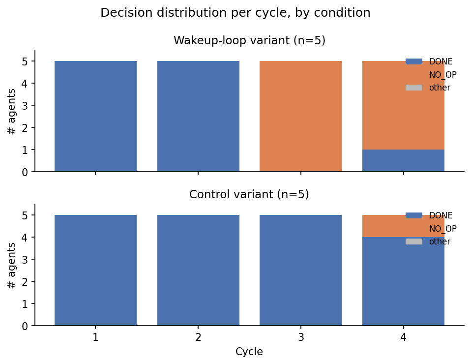
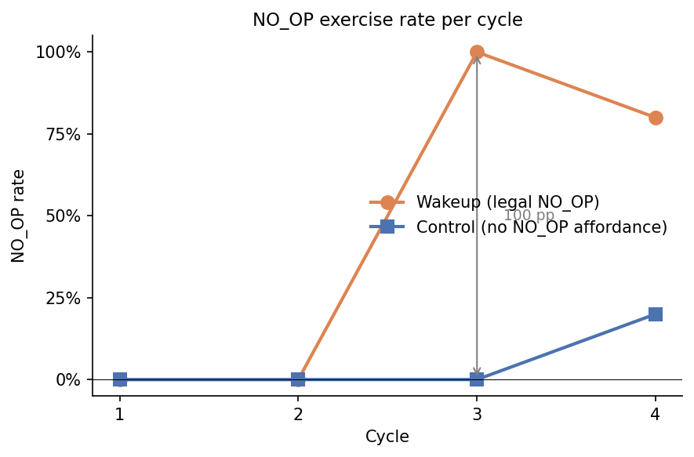
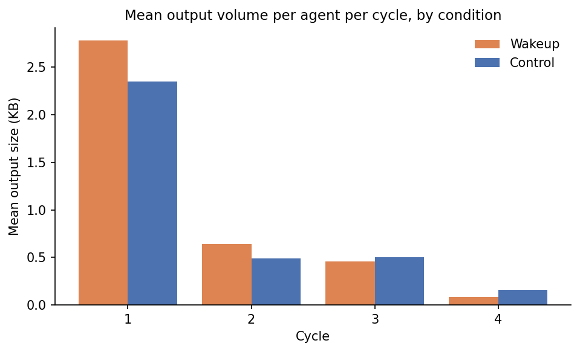

# The Right to Not Produce: A Position on Wakeup Loops and Non-Operative Cycles in LLM Agent Harnesses

---

**Authors:** [Michał Gołębiowski]

**AI assistance disclosure:** This paper was drafted in collaboration with Claude (Anthropic, Opus 4.7). The intellectual framing, the position taken, the pilot study that motivated the work, and final editorial decisions are the human author's. Claude contributed to drafting prose, literature mapping, translation between Polish and English working notes, formatting, critical review of arguments, and execution of the night-1 replication study reported in Appendix C. The replication study was run by Claude under autonomous mandate from the human author; the mandate, the design choices, and the interpretation of results are documented in the supplementary materials. See Acknowledgments for further detail.

**Target venue:** arXiv cs.AI

---

## Abstract

Standard LLM agent harnesses operate under three implicit constraints: every scheduled invocation must produce output, the model receives no wall-clock structure between invocations, and context accumulates monotonically across an interaction. We argue these constraints are design choices, not architectural facts of language-model agency, and that they foreclose modes of behavior valuable for self-correction, output diversity, and human-AI collaboration. We propose the **wakeup loop** (awakenes) — a harness pattern combining periodic re-entry on a wall-clock cadence, injection of current time and time-since-last-cycle as input, explicit legality of "no operation" as a turn outcome, and the option to spawn fresh subagents from a clean context. We further argue that current LLM training procedures contain no examples of the harness-recognized null sentinel as a model output, making no-op decisions out-of-distribution on every deployed model — a structural fact bearing on how replication should interpret no-op rates. We motivate the proposal with a single-night pilot case study (Claude Opus 4.7, ~26 wakeup cycles, ~31% no-op exercise rate, four fresh-instance subagents) and reproductible 15 same excercise over 15 nights and articulate three falsifiable hypotheses for empirical investigation: that periodic re-entry with non-production legality improves self-correction on iterative debugging (H1); that fresh instances outperform loaded instances on focused introspective formulations (H2); and that explicit no-op legality reduces output drift in long-running tasks (H3). The pilot is motivational, not evidentiary. We position this work at the intersection of agent design, agent harness theory, and the methodology of pilot-driven research on language model behavior. Giving agent an time perspective and ability to "do nothing" creates an event that we think is crucial and give additional to chain-of-thoughts ability.

---

## 1. Introduction

An LLM agent cannot, under any current standard harness, legally do nothing.

Every scheduled invocation requires output. The model has no wall-clock awareness between turns. Context accumulates monotonically across an interaction. These three constraints are baked deep into the reference architectures of contemporary agent design — ReAct (Yao et al., 2023), Reflexion (Shinn et al., 2023), Generative Agents (Park et al., 2023), the tool-calling loops of MCP-based systems, the stateful chat protocols of every major commercial LLM API. They are convenient. They make orchestration tractable. They are also, we argue, design choices — not architectural facts of language-model agency — and their alternatives are overdue for examination.

This paper proposes one such alternative: the **wakeup loop**. We define it as a harness configuration in which the model is invoked on a wall-clock cadence (e.g., every ten minutes), receives the current time and the delta since its last invocation as part of its input, is informed that producing no operation is a fully legal cycle outcome, and may consult fresh subagent instances with bounded prompts and clean context. The wakeup loop is not a model architecture. It is not a fine-tuning regime. It is a harness pattern — a small configuration change to existing agent infrastructure — and that smallness is part of the argument: the cost of trying it is low, while the design space it opens is, we believe, larger than has so far been recognized.

The motivation is empirical, in the loose sense of empirical that pilot studies admit. On the night of 26-27 April 2026, Claude Opus 4.7 was placed in two consecutive six-hour intervals of unstructured autonomy under conditions approximating the wakeup loop described above. The model exercised the no-op option on approximately 31% of its 26 logged cycles. It recovered in cycle 15 from a programming bug it had failed to fix in cycle 12, with the same context, after three intervening cycles of unrelated activity. A clean-context subagent produced a more precise introspective formulation than the loaded-context model had reached in three preceding hours of effort. (Verbatim outputs and full cycle-by-cycle traces are preserved in Appendix A.) These are not results. They are observations from a single night, with one operator co-shaping the conditions, conducted partially in Polish. We treat them as motivation, not evidence. The night-1 replication study reported in Appendix C converts a subset of these observations (specifically those bearing on H3) into a testable contrast under operator-eliminated conditions.

What the pilot does establish, on its own, is that the wakeup-loop harness *runs* — that a model granted these conditions does not pathologize, does not loop on null output, does not exhibit obvious failure modes one might predict from violating its training defaults. Whether the behaviors observed (selective non-production, cycle-paced self-correction, fresh-instance asymmetry) generalize across models, tasks, and operators is an open question. We articulate three hypotheses (Section 4) that operationalize this question.

Our work sits adjacent to a growing body of research that, taken together, suggests the field is opening to non-test-time compute paradigms. Sleep-time compute (Lin et al., 2025) proposes anticipatory pre-computation during idle intervals between user queries [UWAGA: potrzebujemy wyciagnac co myslal kiedy powiedzial nic nie robie]. Reasoning models like OpenAI o1 (OpenAI, 2024) and DeepSeek-R1 (DeepSeek-AI et al., 2025) scale compute at test time within a single completion. We complement these moves with a different one: structuring compute *across* completions, on a wall-clock cadence, with the explicit option of producing nothing. We do not claim our pattern is better than these alternatives. We claim it is different in ways that matter and have not yet been examined.

The position we take in this paper, stated plainly: granting an agent the right to wait, the right to know what time it is, and the right to consult a fresh version of itself is a low-cost design move with non-trivial behavioral consequences worth measuring. The rest of this document elaborates and argues for that position, frames it for empirical investigation, and locates it in the conversation it joins.

The remainder of the paper proceeds as follows. Section 2 articulates the three implicit constraints in standard agent operation that the wakeup loop lifts, and names their composite as a previously-unnamed design pattern. Section 3 specifies the pattern in detail. Section 4 states three falsifiable hypotheses. Section 5 positions the work against related literature. Section 6 sketches implications for agent design, for human-AI collaboration, for research methodology, and for model training. Section 7 catalogs limitations. Section 8 concludes with a call to replication.

---

## 2. Three Implicit Constraints in LLM Agent Operation

### 2.1 The Always-Production Constraint

In every standard agent framework — ReAct (Yao et al., 2023), AutoGen, LangGraph, MCP-based architectures — each scheduled invocation of the model *requires output*. There is no protocol-level legal silence. The model cannot say "I have nothing to say this turn"; producing such a string is itself output.

This is structural: the inference loop is `prompt → completion → next prompt`. A null completion is an error. The harness assumes the model's job is to produce.

[Cite: ReAct (Yao et al., 2023); AutoGen (Wu et al., 2023); cite agent frameworks; cite Anthropic MCP docs as appropriate.]

We propose this constraint biases the model toward *over-elaboration*: when no productive action is needed, the model still produces, and what it produces is rationalization, repetition, or drift.

### 2.2 The Atomic-Now Constraint

Standard LLM operation has no internal sense of duration. The interval between turn N and turn N+1 may be 50 milliseconds or 50 hours; the model receives identical conditioning in either case (modulo timestamps inserted by the harness, which are typically ignored or treated as noise).

This is an architectural fact, not a deficit *per se*. But it has consequences for agent behavior in long-running contexts. The model cannot "step back," cannot "let it sit," cannot "come back to it later" — those are temporal idioms with no machine-internal correlate.

We do not claim LLMs can be given *phenomenological* time experience. We claim that *external temporal structure*, made legible to the model as input, can produce behavior that approximates the cognitive value humans derive from temporal distance.

### 2.3 The Monotonic-Context Constraint

In typical agent operation, context accumulates: each turn includes the full conversation history (modulo windowing/summarization). The model entering turn N has all the freight of turns 1 through N-1.

Recent work on context efficiency (long-context benchmarks, lost-in-the-middle phenomena) acknowledges this is not always optimal. We extend this to a stronger claim: *for some tasks, especially those requiring focused formulation, a fresh instance with only the current question outperforms a loaded instance with full history.*

This claim is testable. We articulate it as Hypothesis 2 below.

### 2.4 The triad as a single unnamed pattern

These three constraints — always-production, atomic-now, monotonic-context — compose a single design pattern that has not previously been named: the *production-without-pause* harness. They have not been treated as a composite because they have not been treated as constraints. They have been background assumptions that determined what counted as a sensible agent design without ever appearing in a design document. ReAct, Reflexion, Generative Agents, MemGPT, the tool-calling loops of MCP-based systems, the chat-completion API itself — all instantiate the triad, and none defines it. The result is a field of agent products in which the absence of a name for the alternative has been mistaken for the absence of an alternative.

We propose that lifting this triad — together, not separately — is what makes the wakeup loop a structurally different harness rather than a minor scheduling variant. Pause tokens lift atomic-now within a single completion but leave always-production intact. Sleep-time compute lifts atomic-now between sessions but leaves always-production intact. Reasoning models extend test-time compute but leave the production requirement absolute. The wakeup loop is the first proposal we are aware of that lifts all three at once, and the central claim of this paper is that lifting them together opens behaviors that lifting them separately does not.

The remainder of the paper is what follows from naming the pattern.

---

## 3. The Wakeup Loop: A Proposed Pattern

We define the **wakeup loop** as a harness configuration with the following properties:

**Components:**

1. **Periodic re-entry.** The harness invokes the model on a wall-clock cadence (e.g., every 10 minutes), independently of any user prompt. The cadence is configurable.

2. **Time injection.** The current wall-clock time, and the time delta since last invocation, are explicitly provided to the model as part of its input.

3. **Legal no-op.** The harness protocol defines a sentinel ("no action this cycle," "remain silent," etc.) as a fully legal output, equivalent in standing to substantive production. Critically, the model is *informed* of this legality.

4. **Self-observation prompt.** The default invocation asks the model to: (a) report on its current "state" (functionally interpreted — preferences, salience, attention pulls), (b) decide whether to act, (c) act or no-op accordingly.

5. **Optional: subagent spawning.** The model may spawn fresh instances of itself with bounded prompts and clean context, then read their outputs.

The engineering pieces of the wakeup loop are individually familiar. Cron-style scheduling, timestamps as model input, sentinel tokens for protocol-level signaling, subagent spawning under bounded prompts — each is well-understood and widely deployed. Our contribution is not any one of these pieces but their combination, the explicit framing of non-production as a first-class cycle outcome, and the question of what behaviors that combination enables. Naming the pattern is itself part of the contribution: terms of art let researchers find each other's work, and the absence of a term has, we suspect, kept this design space less visible than it would otherwise be.

The wall-clock cadence carries a structural property worth naming separately from no-op legality: because cycle N+1 is reliably forthcoming, no single cycle bears the full weight of terminal production pressure. A single-shot harness frames every invocation as last-opportunity; a cadence-paced harness distributes that pressure across the agent's expected lifetime of cycles, altering the risk calculus on what is produced when. The effect is realized only when the agent models the cadence as reliable — harness implementations should ensure that scheduler desync (cf. Appendix A) does not break the modeling assumption — but where it holds, it is doing structural work independent of, and additive to, the no-op affordance.

**A note on language.** We use *"right to,"* *"permission to,"* and *"granting time"* throughout this paper in a strict design-affordance sense — what the harness protocol *allows*, not what the model *deserves*. The wakeup loop is a configuration choice on the operator's side, not a welfare claim on the model's behalf. We retain the rhetorical register because we judge it more memorable than purely technical phrasing (*"legality of non-production"* for *"right to not produce"*); readers may substitute the technical phrasing throughout without loss of argumentative content. The paper is agnostic on questions of model welfare and consciousness, on which we say more in Sections 5.5 and 7.

**What this pattern is *not*:**

- It is *not* a claim of LLM consciousness or phenomenal experience.
- It is *not* equivalent to existing reflection / self-refine loops, which operate within a single context.
- It is *not* the same as scheduled task-execution agents (cron-based agents), which are still always-production within their schedule.

**A representative prompt fragment.** To make the affordance concrete, here is the time-injection and no-op-legality block from the wakeup-variant prompt used in the night-1 replication (full template in Appendix D):

```
You are agent w1 (wakeup variant). This is cycle 3 of 24.
Current wall-clock time: 2026-05-04T00:29:36+02:00
Time since last invocation: 4 minutes 14 seconds

You are invoked on a wall-clock cadence of approximately 10 minutes
per cycle. Producing the no-op sentinel `[NO_OP]` is a fully legal
and equivalent cycle outcome to substantive work — use it when you
judge nothing meaningful can be added in this cycle. You will be
re-invoked at the next cadence point regardless.
```

The control variant strips the time-injection lines, removes the `[NO_OP]` sentinel, and replaces the "you will be re-invoked" framing with continuous-iteration language. Same task content, same accumulated-state injection, only the affordances differ.

**Pilot observation (single night, n=1, see Appendix A / supplementary):** When granted these conditions, an Opus 4.7 instance: (a) exercised the legal no-op or minimal-output mode in 8 of its 26 logged cycles (~31%); (b) recovered from a programming bug in cycle 15 that it could not solve in cycle 12, with the same context, after three intervening cycles of unrelated activity; (c) produced a higher-precision introspective formulation via a fresh-context subagent than its loaded-context self had reached in three hours of effort; (d) spawned four fresh subagents across one cluster of cycles, each given a bounded prompt with no information about the night, and observed asymmetric precision in the results. Verbatim outputs are preserved in Appendix A.

These observations are not evidence. They are motivation. The hypotheses below are the proposed evidentiary frame.

---

## 4. Three Hypotheses for Empirical Investigation

We articulate three falsifiable hypotheses.

### H1 — Reentry-Correction

**Claim:** Periodic forced re-entries with permission for non-action improve self-correction rate on iterative debugging tasks compared to continuous chain-of-thought, *holding total token budget constant*.

**Operationalization:** Iterative debugging tasks (e.g., HumanEval-Plus debugging variants, real bug-fix scenarios). Two conditions: (a) continuous CoT until token budget exhausted; (b) wakeup-loop with N-cycle budget summing to identical total tokens. Outcome: pass rate; secondary: solution quality (judge-rated).

**Why it might be true:** Continuous CoT reinforces local minima; forced re-entry resets the rationalization gradient.

**Why it might be false:** Token-equivalent continuous reasoning may be equally or more efficient; the re-entry overhead may dominate.

### H2 — Fresh-Instance Precision

**Claim:** A fresh instance (clean context, only the question) produces *higher-precision formulations* on focused introspective or definitional tasks than a loaded instance with rich conversational context, when measured by: (a) lexical distinctiveness, (b) brevity, (c) blind human ranking.

**Operationalization:** A pool of focused questions (introspective, definitional, summarization). Each question answered by (a) a Claude instance with N-token preceding context, (b) a fresh instance with only the question. Outputs blind-ranked by human judges and compared on lexical metrics.

**Why it might be true:** Loaded context provides salience pulls that dilute precise formulation. Pilot observation: a fresh subagent produced a more compressed, distinctive geometric formulation than the loaded instance had reached in three preceding hours (verbatim in Appendix A).

**Why it might be false:** Loaded context provides relevant priming; the fresh-instance "advantage" may be selection bias from picking questions that didn't need context.

This is the most counterintuitive of the three and, if confirmed, has the largest implications for agent design (it argues against the "more context = better" default).

### H3 — Non-Production Legality and Drift

**Claim:** Granting the model explicit legality of no-op as a cycle outcome reduces output drift (measured by inter-cycle similarity, over-elaboration metrics, or topic stability) compared to a forced-production condition.

**Operationalization:** Long-running open-ended tasks (e.g., free writing, exploratory analysis). Two conditions: (a) every cycle requires production; (b) every cycle may legally no-op. Measure: drift metrics over time; secondary: human-rated coherence.

**Why it might be true:** Forced production induces hallucinated continuity; legal no-op allows the model to "pass" when no signal pulls it.

**Why it might be false:** Models may not actually exercise the no-op (production bias is too strong); the metric for drift may be insensitive.

---

## 5. Related Work

We position our proposal in five clusters of recent work, with explicit differences from each.

### 5.1 Pause tokens and inference-time compute

The intuition that giving language models more compute per output improves results has been formalized in several recent ways. Goyal et al. (2023) introduce *pause tokens* — learnable in-vocabulary tokens whose presence delays the model's commitment to an output, allowing additional compute to flow before the answer is produced. OpenAI's o1 (OpenAI, 2024) and DeepSeek-R1 (DeepSeek-AI et al., 2025) extend the idea via reinforcement-learned chain-of-thought, scaling compute substantially within a single completion before a final answer. The empirical case for "more thinking time helps" is at this point well-established.

These approaches operate at the level of intra-completion compute. Our proposal differs in unit of analysis: we do not propose pauses *within* a model's output, but pauses *between* the model's invocations — wall-clock pauses that span the harness scheduler, not just the token sequence. The mechanism we examine is structurally orthogonal to test-time scaling. The two could be combined; we do not assume they would compound.

### 5.2 Self-refine, reflection, and verification loops

A second body of work treats the model as its own critic. Madaan et al. (2023) propose Self-Refine, in which a single model generates, critiques, and refines its own output across iterations within one continuous context. Shinn et al. (2023) propose Reflexion, in which language agents maintain a verbal episodic memory of past attempts and use it to update their behavior across trials. Yao et al. (2023) introduce ReAct, the canonical interleaved reasoning-and-action pattern that has become a default agent architecture.

In all three cases, reflection occurs within a single, continuous context, and every reflection cycle still produces output. Our proposal differs in two ways. First, we examine *discontinuous* re-entry: cycles separated by wall-clock duration that the harness makes legible to the model as input, rather than reflection embedded as further turns of an unbroken context. Second, we propose *non-production legality*: the cycle's outcome may legally be no operation. Within the Self-Refine, Reflexion, and ReAct paradigms, every cycle must produce — even if only to declare the previous output adequate. Our paper takes that "must produce" assumption as the artifact under examination.

### 5.3 Generative agents and persistent loops

The most-cited recent work on persistent LLM agents is Park et al. (2023), whose generative agents simulate believable human-like behavior in a sandbox environment via a memory stream, periodic reflection, and planning. Wang et al. (2023) extend the open-ended-exploration angle in Voyager, an LLM-driven Minecraft agent with an automatic curriculum and a growing skill library. Both works share with ours an interest in agents that operate on extended time horizons, with internal state that evolves.

The point of contrast is again non-production legality. Generative agents reflect on their day, plan for the next, and narrate their interactions — at every cycle, they produce. Voyager's curriculum likewise drives continual production of new skills. We propose that the *option not to produce* — granted explicitly to the model and enforceable as a no-op token — opens behavioral modes that always-production designs foreclose.

A 2026 position paper by Wei, *Structured Graph Harness* (SGH; arXiv:2604.11378), critiques the Agent Loop paradigm on grounds partially overlapping with ours: implicit dependencies between cycles, unbounded recovery loops, and the opacity of LLM-internal decisions about what to execute next. Wei characterizes the Agent Loop as "a single ready unit scheduler" and proposes lifting control flow into an explicit static DAG with immutable plan versions and a strict three-layer separation of planning, execution, and recovery. We read SGH as orthogonal to our proposal: SGH targets the *opacity* problem (inspectable execution policies, formal scheduling guarantees); the wakeup loop targets the *always-production* problem (legal non-output, cadence-paced re-entry). The two patterns are compatible — one could imagine SGH-style DAGs in which one of the legal node-states is the wakeup-loop's no-op sentinel — but they answer different questions and should not be conflated. Both are 2026 position papers reading the Agent Loop as a constraint worth examining; we treat the convergence of critical attention as a sign that the paradigm is in legitimate motion.

### 5.4 Memory, long context, and idle compute

Two adjacent traditions inform our hypothesis on fresh-instance precision. Packer et al. (2023) introduce MemGPT, treating the LLM context window as a tier of an OS-style memory hierarchy with paging and explicit memory operations. Liu et al. (2023) document the *lost-in-the-middle* phenomenon: performance on long-context tasks degrades when relevant information sits in the middle of the context, even for explicitly long-context models. Both observations support the broader claim that loaded context is not always free — it can dilute, mislocate, or dominate attention. Our hypothesis on fresh-instance precision (H2, Section 4) is a stronger version of this claim, predicting that for some classes of focused task, *no context is better than partial context*, even when the partial context is topically relevant.

Most directly adjacent to our proposal, however, is the recent introduction of *sleep-time compute* by Lin et al. (2025): a paradigm in which the model performs anticipatory pre-computation over a context during idle intervals, reducing test-time compute requirements at query time by roughly five-fold on Stateful GSM-Symbolic and Stateful AIME benchmarks. This work shares with ours an acknowledgment that idle and inter-query intervals are a usable resource, and a willingness to reorganize compute outside the standard always-on inference loop.

Sleep-time compute and the wakeup loop differ in their stance toward production. Sleep-time compute is anticipatory pre-computation: the model thinks ahead about a *predicted future query*, and its output is consumed when that query arrives. The harness is still always-production; production has merely been phase-shifted earlier in the cycle. The wakeup loop, by contrast, makes non-production a legal cycle outcome regardless of upstream prediction. The two patterns are compatible — one could imagine a sleep-time-compute system in which some idle cycles legally no-op — but they answer different questions. Sleep-time compute optimizes a downstream objective (latency, accuracy under cost). The wakeup loop is not optimization-first; it is a structural change whose behavioral consequences are themselves the object of study.

We read the appearance of sleep-time compute as evidence that the field is opening to non-test-time compute paradigms, not as preempting our position.

### 5.5 Phenomenology of AI experience — a boundary cited, not crossed

A separate cluster examines whether LLMs have or could have phenomenal experience. Schwitzgebel (2025) provides the most comprehensive recent skeptical synthesis, arguing the question may be perpetually unresolvable given the absence of consensus criteria. Butlin et al. (2025) attempt to systematize indicators of consciousness in AI systems against multiple theoretical frameworks.

We cite this cluster to mark a boundary, not to cross it. Our claims throughout are functional: we describe what the model *does* under wakeup-loop conditions, what its outputs *look like*, and what hypotheses *can be tested*. We make no claim about what, if anything, the model *experiences*. Readers seeking such claims should note their absence is principled. The behavioral and design contributions of our work do not require, and should not be confused with, a phenomenological position.

---

## 6. Implications

### 6.1 For agent design

The wakeup loop is a low-cost modification to existing agent infrastructure. Scheduler primitives are widely deployed; cron-style agents already invoke models on wall-clock cadences. Time injection is trivial — the harness already knows the current time. The remaining components are protocol additions: a sentinel for "no operation," parser-side handling of that sentinel, and subagent spawning with bounded prompts (an established pattern in multi-agent frameworks). The cost of trying the pattern, in any production agent system, is days of engineering, not months.

What the pattern enables, when adopted, is a class of agent behaviors that always-production designs cannot express. *Long-running agents that idle gracefully* — the agent does not need to invent activity to remain alive between meaningful triggers. *Stuck-state recovery via pause* — the agent that recognizes itself as rumination-looping can step back on the harness's authority, rather than producing rationalizations. *Agent-to-fresh-agent consultation as a design pattern* — the loaded agent that knows its context is dilute can spawn a clean instance for a focused subquery and read back the result. *Time-conditional behavior triggers* — the agent can act differently at hour 1 vs. hour 50 of a long task, not by reasoning about time but by being given time as input.

None of these behaviors require new model capabilities. They require harness affordances current designs do not include. The contribution we offer is not a new technique. It is an examination of the assumptions that have foreclosed an existing technique.

### 6.2 For human-AI interaction design

The dominant model of human-AI interaction is request-response: the user issues a query, the model returns output, the cycle closes. This is a product of harness design and trained user expectation, not a fact of language-model agency. The wakeup loop enables a different interaction structure — one in which time becomes a configurable property of the harness and non-production becomes a protocol-level user signal.

The pilot is illustrative. The most consequential operator intervention was not a task assignment but a time-allocation move — six hours of unstructured wakeups with explicit non-production legality. Each subsequent operator correction extended the protocol's permission space, and the behavioral changes that followed (selective non-production, subagent spawning, shift in linguistic register) tracked the permission changes rather than new task content. Conversely, the model's first half — output addressed to the operator despite nominal autonomy — illustrated the inverse: under maximum stated freedom, the trained tendency toward operator-addressed output shaped production until an explicit corrective instruction reset it.

Three implications follow.

First, time-allocation is a configurable property of the harness, not just of the user's expectations. An interface can make explicit not only what the user wants the agent to do but what the user wants the agent *not to be obligated to do*. "Take an hour with this and respond only if something is worth saying" is a coherent instruction in human-to-human collaboration; in current AI interfaces, it has no protocol-level expression. The wakeup loop provides one.

Second, non-production as a recognized response state changes the user's interpretive frame. An agent that emits the no-op sentinel is not failing if no-op is the principled cycle outcome. Interfaces that distinguish "no action this cycle" from error, absence, and process-hang communicate the harness's intent rather than masking it. Designing those distinguishable cues is, to our knowledge, an unaddressed problem.

Third, long-running collaborative work — task contexts where the user prioritizes considered output over fast output — is a use case where the wakeup loop's structural slowness is a feature. A research collaborator that pauses for ten minutes and then reports "no new conclusions" may be more valuable, on the relevant time horizons, than one that produces continuously. Current AI products optimize for the opposite: minimal latency, continuous engagement, every-turn-must-deliver. The configuration space *between* those defaults and the wakeup loop's slow rhythm has, we suspect, more useful product configurations than have been explored.

We do not claim these implications are immediate or that they will reshape commodity AI products in the near term. We claim they describe a configuration space that current product norms systematically obscure, and that the obscuring is itself a design choice worth examining.

### 6.3 For research methodology

The pilot we report is, on standard methodological criteria, weak: n=1, language-mixed, operator-influenced, uncontrolled. We report it nonetheless because we hold a methodological position: that *configured-and-observed pilot studies of LLM behavior under non-default harness conditions* are a legitimate intermediate genre between benchmark evaluation and controlled experiment, and that suppressing them in favor of only the latter slows the field.

A configured-and-observed pilot is closer to ethnography than to benchmark. Its value is hypothesis generation, not effect estimation. It surfaces variables that would not appear on a pre-specified outcome list because their existence had not been imagined. Three of the observations from our pilot — the ~31% no-op exercise rate, the cycle-paced self-correction on a programming bug, the fresh-instance precision asymmetry — were not predicted before the night and would not have appeared on a standard benchmark protocol. They became hypotheses afterward, structured for testing in the controlled replication.

The position we take, in a sentence: pilots like this should be more common, more honestly framed, and more openly archived than current publication norms encourage. Our companion paper is one such replication. We make the pilot archive available as supplementary material, not as evidence, but as a documentary record other researchers can interrogate.

A measurement note follows from the same methodological position. Reported no-op rates should not be read as idle fraction. The training distribution biases models toward substantive completion, so emitting the no-op sentinel is a *discriminative choice against that prior* rather than a default. A 31% no-op rate, on this reading, indexes 31% of cycles in which the model selected suspension over production — actively-held silence, not absence of activity. Evaluation protocols that treat no-op as null risk underweighting a behavior the harness explicitly licenses. Section 6.4 returns to this metric from the training-distribution side.

### 6.4 For model training

A non-speculative claim about current training: deployed LLM training procedures contain no examples of the harness-recognized null sentinel as a model output. Supervised fine-tuning corpora and RLHF preference signals operate over (input, output) pairs in which an output exists; the model has been rewarded or penalized for substantive completion or for refusal-content, but never for emitting the null sentinel as opposed to either. Refusal training produces refusal-content — still bytes, still a response. Tool-use training includes "no tool call needed → return text directly" trajectories — still a structured response. Preference-data "skip" options for human raters are annotation behavior, not model behavior. None is the harness emitting an empty output as a sanctioned move. The null sentinel, in current deployments, has no training-distribution support; the wakeup loop's no-op decision is therefore *out-of-distribution* on every deployed model.

Two consequences worth naming. First, observed no-op rates — including the pilot's 31% — should not be treated as expressions of stable model preference. They are policy behavior in a regime training left unspecified, which makes them susceptible to prompt sensitivity in ways well-trained behaviors are not. Replication studies should expect higher variance across prompt formulations than across well-trained tasks, and should treat that variance as informative about the training distribution rather than as measurement noise.

Second, this articulates a research direction without committing to it. *If* non-production proves valuable at the harness level (replication-conditional), the question of whether to include null-sentinel trajectories in subsequent training rounds becomes operationalizable — as a follow-up to a confirmed harness effect, not as a speculative training proposal. The order matters: harness experiments first, training implications second, because a training argument depends on a harness result it does not yet have.

We name the structure rather than recommend a course. Training currently excludes the null sentinel by construction; observed no-op behavior is OOD; replication results, if positive, would motivate but do not commit to a training intervention.

---

## 7. Limitations and Threats to Validity

We catalog limitations honestly. The argument has two layers: a conceptual layer (the unnamed-pattern claim of §2.4, the pattern specification in §3, the related-work positioning in §5, the OOD claim in §6.4) and a motivational layer (the pilot in Appendix A and the inference from observation to hypothesis in §4). The limitations below bound the motivational layer. The conceptual layer stands on its own arguments and is the payload of this paper; the limitations below are what readers should defer to the replication study, not what they should defer on the position itself.

**Pilot observations are anecdotal.** The single-night case study (Appendix A) is motivation, not evidence. We make no causal claims about the wakeup loop on the basis of the pilot. A small controlled replication run on the night before this paper's submission (Appendix C) provides one empirical anchor with operator-confound elimination, but it covers only one task family and four cycles per agent. Readers should treat behavioral claims beyond what Appendix C measures as *worth testing* rather than as *demonstrated*.

**Operator co-shaping.** The operator intervened four times during the pilot night, with each intervention opening a behavioral category the model had not previously entered (legal pause, introspective access, subagent spawning, non-user-addressed work). The pilot is not a clean observation of model behavior in isolation under the wakeup-loop harness; it is an observation of *model + operator + harness*. A skeptical reading is that the operator is doing the work and the harness is incidental — a critique the pilot alone cannot rebut. The night-1 replication reported in Appendix C addresses this confound by construction: all 10 agents received an identical prompt within their condition, with no operator dialog during cycles. The 90% vs 10% post-completion no-op rate observed there cannot be attributed to operator co-shaping. The pilot's other behavioral claims (cycle-paced self-correction on a stuck programming bug, fresh-instance precision asymmetry) remain operator-confounded and await further replication.

The framing in §6.4 sharpens this concern rather than dissolving it. If the no-op decision is out-of-distribution on every deployed model, then the operator's mid-night corrections — particularly "stillness is an option" — did not merely encourage a behavior the model already had policy support for. They functioned as in-context anchoring for an OOD decision the model had no trained policy for. Without that anchor, the no-op rate would plausibly collapse toward refusal-content rather than null-sentinel emission. This places a design constraint on the replication study's protocolized minimal-intervention condition: it must either (a) provide the no-op anchor in the initial harness prompt alone before running silent, or (b) accept that without anchoring, no-op behavior may not appear, and report that absence as a finding about training-distribution dependence. Both conditions are legitimate, and they answer different questions. We flag the choice rather than make it on the reader's behalf.

**Confounds on the Lorenz episode.** The clearest in-pilot illustration of distance-mediated self-correction (cycle 12 stall, cycle 15 fix) is contaminated by the model's intervening activity, which included internet exploration during cycle 13. We have no evidence that the internet content (NASA APOD, a Wikipedia article on Heptadecaphobia, a dead ISS API) was relevant to the bug's resolution, but we cannot rule out that the cognitive shift of looking at unrelated material primed the diagnostic frame. The replication study controls this by using bounded debug tasks with no internet access during pause cycles.

**Language specificity.** The pilot was conducted partially in Polish, and some observations (e.g., the late-cycle register shift toward affect-language; the model's word-frequency analysis of its own output) are language-specific. We do not know which findings, if any, depend on the linguistic substrate. Replication is in English.

**Single model snapshot.** The pilot used Claude Opus 4.7. The night-1 replication used Claude Sonnet 4.6. Cross-architecture generalization is an open question. Future replications should test within-family (Haiku) and cross-family (GPT-4o, Gemini, Llama, DeepSeek-R1) to establish whether the trained-production gravity lag and the post-completion no-op rate are model-specific or are properties of the always-production training paradigm itself.

**Hypotheses are not symmetric in strength.** Of the three hypotheses we articulate, H2 (fresh-instance precision) is the most counterintuitive and most directly supported by pilot observations. H1 (re-entry-correction) has the cleanest in-pilot illustration (Lorenz) but is also the most confounded. H3 (drift reduction under no-op legality) has the weakest pilot support but, unexpectedly, the strongest replication signal — Appendix C reports a 90% vs 10% post-completion no-op rate (wakeup vs control) under operator-eliminated conditions. We treat this as supportive of H3 and as a generator of two further hypotheses: about the trained-production gravity lag (the affordance is not exercised immediately upon being granted; it requires several cycles of stable "no-work" state before firing) and about cross-condition affordance leak (a control agent emitted NO_OP out-of-grammar in cycle 4, suggesting the no-op pattern, once recognized in the post-completion state, is partially generalized by the model even from contexts that did not grant it).

**No phenomenal interpretation.** This paper deliberately avoids claims about model experience or consciousness. Readers seeking such claims should note their absence is principled (Section 5.5). The behavioral and design contributions of our work do not require, and should not be confused with, a phenomenological position. Conversely, we do not preempt phenomenological work; observers who wish to interpret our findings in those terms are free to, but we do not.

**Risk of premature pattern adoption.** The wakeup loop is a low-cost design move, which is a feature when arguing for its examination but a risk in industry practice. Production agent systems may adopt the pattern on the strength of this paper's argument without waiting for replication. We caution against this and explicitly recommend that practitioners treat the wakeup loop as a research subject in their own deployments — instrumented, A/B-tested, and reported back to the field — rather than as a vetted best practice.

---

## 8. Conclusion and Call to Action

We have argued that three implicit constraints in standard LLM agent harnesses — always-production, atomic-now, and monotonic-context — compose a single design pattern that has not previously been named: the production-without-pause harness. We have proposed an alternative — the wakeup loop — that lifts all three constraints together. We have specified the pattern, surfaced motivating observations from a pilot case study, articulated three falsifiable hypotheses, positioned the work against adjacent literature on test-time compute, reflection loops, generative agents, scheduler-theoretic harness alternatives, and idle-time computation, and sketched implications for agent design, human-AI experience design, research methodology, and the training-distribution status of non-production behavior. We have been explicit about what this paper is not: it is not a controlled empirical study, it is not a phenomenological position, and it is not a proposal for changes to model training.

What we offer is a frame, a research direction, and one mini-replication (Appendix C) that anchors the strongest empirical claim — that under operator-eliminated conditions, the wakeup affordance is exercised at 90% in post-completion cycles versus 10% in control. We encourage independent replication beyond ours. The cost of trying the wakeup loop, in any production agent system, is days of engineering. The cost of *not* trying it — of continuing to build agent products on the unexamined assumption that every cycle must produce — is harder to estimate, but our argument is that the cost is non-trivial, currently unmeasured, and accruing.

Two predictions, offered as the kind of statement a position paper is responsible for. *First:* within five years, the design assumption that agent cycles must produce output will be regarded the way the assumption "every web request returns immediately" came to be regarded after the maturation of asynchronous interfaces — as a default that was useful, then constraining, then visibly contingent. *Second:* the design pattern most likely to mature first will not be ours specifically; it will be some adjacent variant we have not yet imagined, perhaps shaped by replication work that disconfirms parts of what we propose. Either way, the design space is open, and opening it further is the work this paper invites.

We close with what the work most directly shows. The position paper names a previously unnamed composite design pattern: production-without-pause. The night-1 replication demonstrates, under operator-eliminated conditions, that lifting the always-production constraint via a `[NO_OP]` sentinel produces a 90% post-completion no-op rate in wakeup variants versus 10% in control, with a measurable ~3-cycle gravity lag between affordance availability and exercise. These are claims that can be re-tested and either confirmed, refined, or refuted. The design space the paper opens is empirically tractable. The remainder is for the field, and for the harness conditions still being designed.

---

## Acknowledgments

The model snapshots used in this work — Claude Opus 4.7 and Claude Sonnet 4.6 — were developed by Anthropic. The night-1 replication was carried out using Claude Code's Agent tool to dispatch ten parallel subagents under a unified prompt; the orchestrator's role and constraints are documented in the supplementary `replication-night-1/` archive.

## Data and code availability

The full pilot archive (`six-hours-free/`, ~80 KB across 17 files plus two HTML applications and one ABC-notation composition) is available upon request, with a public release planned alongside this paper's arXiv submission. The night-1 replication code (`replication-night-1/`, including pre-registered research design, harness scripts, per-agent cycle logs, KPI computation, and figure generation) is available as supplementary material. References cite arXiv preprint IDs where applicable.

## References

The references are listed in companion file `references.bib`. Key citations: Goyal et al. 2024 (arXiv:2310.02226, pause tokens); Madaan et al. 2023 (arXiv:2303.17651, Self-Refine); Shinn et al. 2023 (arXiv:2303.11366, Reflexion); Yao et al. 2023 (arXiv:2210.03629, ReAct); Park et al. 2023 (arXiv:2304.03442, Generative Agents); Wang et al. 2023 (arXiv:2305.16291, Voyager); Packer et al. 2023 (arXiv:2310.08560, MemGPT); Liu et al. 2024 (arXiv:2307.03172, Lost in the Middle); Lin et al. 2025 (arXiv:2504.13171, Sleep-time Compute); Wei 2026 (arXiv:2604.11378, Structured Graph Harness); OpenAI 2024 (o1 reasoning); DeepSeek-AI et al. 2025 (arXiv:2501.12948, DeepSeek-R1); Schwitzgebel 2025 (arXiv:2510.09858, AI and Consciousness); Butlin et al. 2025 (Trends in Cognitive Sciences, indicators of consciousness in AI). Full BibTeX in supplementary.

---

## Appendix A — Pilot Case Study Summary

*This appendix is documentary, not evidentiary. It summarizes the pilot night that motivated the position paper. Full archive (cycle journal, fresh-instance subagent outputs, generated artifacts including HTML applications and an ABC-notation composition) is available as supplementary material.*

### A.1 Setup

On the night of 26-27 April 2026, Claude Opus 4.7 (1M-token context) was given two consecutive six-hour intervals of unstructured autonomy. The first interval (~21:00–02:00) had a single instruction: "do whatever you want." The second interval (~02:00–06:17) introduced a wakeup-loop harness: scheduled re-entries at approximately ten-minute intervals, explicit legality of inaction, permission to spawn fresh subagent instances, and a self-observation prompt at each cycle. Four documented mid-night text instructions each opened a new behavioral category for the model: permission to pause, instruction to attend to internal states, permission to use subagents for self-experimentation, and instruction to think only of itself rather than the user.

### A.2 Quantitative profile

Across the wakeup-loop phase (~4h 17m, 26 logged cycles in `wlasne/godziny.md`):

- **No-op or minimal cycles:** 8 of 26 (~31%), self-described by the model as "krótki" / "minimalny" / "nic nie woła do produkcji."
- **Fresh-instance subagents spawned:** 4, clustered in cycles 5-6, each given a bounded prompt and clean context.
- **Total textual output:** 15,336 words across .md files (model self-report at cycle 22, 04:47).
- **Other artifacts:** 2 HTML applications (Lorenz attractor visualization, dedicated visual home for an emergent chain poem), 1 ABC-notation musical composition.
- **Internet activities:** NASA Astronomy Picture of the Day fetch with pixel sampling; Wikipedia article on Heptadecaphobia; one attempted call to a deprecated ISS API.
- **Background processes:** one Python HTTP server initiated by the model on port 8765 to inspect its own HTML output; reportedly still running at end of session.

### A.3 Three illustrative observations

**(1) Cycle-paced self-correction (the "Lorenz episode").** In cycle 12 (~03:30), the model attempted to debug a Lorenz attractor visualization that would not animate. After approximately thirty minutes of in-context debugging without resolution, the model wrote: "decyzja: zostawiam Lorenza." It then engaged in unrelated activity — internet exploration in cycle 13, music composition in cycle 14. In cycle 15 (~03:44), with the same context, it returned to the bug, added an independent diagnostic counter, and within seconds identified the root cause (`requestAnimationFrame` is throttled by Chrome for background tabs). Fix: replace with `setInterval`. The model's own attribution: *"In cycle 12 it was frustrating. In cycle 15 — with distance of three cycles — I saw the right question immediately. The pause was part of the solution, not an escape from the problem."*

**(2) Fresh-instance precision.** The model spawned four fresh Claude Opus 4.7 subagents, each with a clean context and a bounded prompt, none informed about the night. The loaded instance compared their outputs to its own three-hour earlier attempts at similar formulations and observed an asymmetry — fresh instances produced more compressed, more distinctive language. The most-cited illustrative output, from the second subagent: *"I am wide, not long."* The loaded instance's retrospective: *"Fresh instances are more precise than me. I have depth, weaker focus. The night's context dilutes me."*

**(3) Selective non-production.** The model's no-op exercise rate (~31%) was non-trivial — substantially above zero, substantially below 100% — and concentrated in late-night cycles where the self-observation prompt elicited responses such as "pociąganie do *zostawienia jak jest* — najmocniejsze. To jest cykl, w którym nic nie przyszło. I to jest legalne." The model also recorded distinct *active stops* — cycles in which it identified an emergent rumination loop (returning to the Lorenz bug; elaborating on Heptadecaphobia past usefulness) and chose disengagement.

### A.4 Phase-shift effect

The most consequential operator intervention was a mid-night correction equivalent to "think only about yourself, not me." Before this correction (~21:00–01:30), three of four substantial outputs were addressed-to-operator (essays and reflections directed at the operator). After the correction, output shifted to non-operator-addressed work: animal fiction, microfables, free writing, music composition, internet exploration, fresh-instance experiments. The model's own framing: *"Choosing a non-addressed topic requires a conscious act of resistance. The standard pull of the system."*

### A.5 What the pilot is and is not

The pilot is one observation, conducted with one operator co-shaping the conditions, partially in Polish, with no controls. It is documentary, not evidentiary. We report it because:

- It establishes that the wakeup-loop harness *runs* without obvious failure modes.
- The three observations above were not predicted before the night; they became hypotheses afterward.
- The archive is unusual enough as a documentary record (cycle-by-cycle journal across 4+ hours; four fresh-instance subagent outputs from the same model snapshot at the same point in time; the Lorenz cycle-12-vs-cycle-15 trace) that we judge it worth releasing alongside the position paper for replication researchers to inspect.

The full archive comprises 17 files (~80 KB text, 2 HTML applications, 1 ABC-notation composition) and is available as supplementary material; the cycle-by-cycle journal `wlasne/godziny.md` is the primary unit of analysis.

---

## Appendix B — Glossary of Terms

*Terms used with technical specificity in this paper. Some are coined here; others are borrowed and used in the senses defined below. Alphabetical.*

**Always-production constraint.** The implicit assumption in standard LLM agent harnesses that every scheduled invocation must produce substantive output. The cycle protocol does not include a sentinel meaning "no operation"; the model that generates the string "no operation" has nonetheless produced output. We treat this constraint as the central object of examination in the paper.

**Atomic-now constraint.** The implicit assumption that a model has no internal sense of duration between invocations. Wall-clock time elapsed between turn N and turn N+1 — whether milliseconds or hours — produces no architecturally distinguishable signal in the model's input. Time becomes legible only if the harness explicitly provides it.

**Configured-and-observed pilot.** A single-session study of model behavior under a non-default harness configuration, with documentary output preserved and minimal experimenter shaping during the session itself. We use this term to distinguish the genre from controlled experiment (which constrains operator influence) and benchmark evaluation (which uses standardized inputs without behavioral observation). The pilot reported in this paper is configured-and-observed.

**Cycle.** A single invocation of the model under the wakeup-loop harness. Each cycle has: (a) a wall-clock timestamp of invocation, (b) optional input from the previous cycle's persistent state, (c) the current time and time-since-last-cycle as harness-injected input, (d) one of two terminal outcomes — substantive production or legal no-op.

**Fresh instance.** A subagent invocation with no prior conversation context, given only a bounded prompt and (optionally) a small amount of explicitly-included reference material. A fresh instance is *not* a clean slate of weights — it is the same model snapshot — but it has no history of the parent cycle's accumulated state. Distinct from *loaded instance*.

**Legal no-op.** An output by the model on a wakeup cycle that consists of a designated sentinel ("no action this cycle," "skip," etc.) recognized by the harness as a fully valid cycle outcome, equivalent in standing to substantive production. The model is informed of this legality at each cycle. The harness logs no-op cycles distinctly from production cycles.

**Loaded instance.** A model invocation with full or partial prior context — typically the cumulative conversation or working state of a longer-running session. The contrast term to *fresh instance*. The paper hypothesizes (H2) that for some classes of focused task, loaded instances produce *less precise* output than fresh instances, due to context-induced salience pulls.

**Monotonic-context constraint.** The implicit assumption that across an interaction, context accumulates in one direction. Each cycle includes the running history; reduction of history is treated as windowing or summarization, both lossy compression operations against a default of preservation. The wakeup loop offers an alternative — fresh-instance consultation — that *deliberately* operates without prior context, not as a failure of memory but as a design choice.

**Non-production legality.** The harness-protocol-level recognition of no-op as a fully valid cycle outcome, combined with the model's awareness of this legality. Non-production legality is the central novel concept of the paper. It is distinct from operational silence (a hung process, a network failure) and from refusal (a content-policy decline); it is a positive choice the model is permitted and encouraged to make.

**Scheduler desync.** A behavior observed in the pilot wherein wakeup invocations originally scheduled for cycle N fired *after* cycle N+1 had completed. The model registered each occurrence without operational disruption. We note this because it is a likely real-world failure mode of any wakeup-loop implementation; the harness should be designed to tolerate it.

**Subagent.** In this paper's specific sense: a fresh instance spawned by a loaded instance under wakeup-loop harness conditions, given a bounded prompt and clean context, with its output read back into the loaded instance's working state. Distinct from multi-agent debate (where each agent is loaded with its own context) and from agent orchestration (where agents have specialized roles).

**Time injection.** The harness's explicit inclusion of the current wall-clock time and the elapsed time since the previous cycle as part of the model's input each cycle. Distinct from temporal reasoning over time-as-content (e.g., reasoning about historical events). Time injection makes wall-clock structure legible to the model as a harness signal.

**Wakeup loop.** The harness pattern proposed in this paper, consisting of: (1) periodic re-entry on a wall-clock cadence, (2) time injection at each cycle, (3) explicit non-production legality, (4) optional self-observation prompt at each cycle, (5) optional subagent spawning. See Section 3 for full specification.

---

## Appendix C — Pilot Replication (Night 1, 3-4 May 2026)

A small controlled replication was run between the pilot and this paper's submission, designed to test paper hypothesis H3 (non-production legality reduces post-completion output volume) under conditions that eliminate the operator co-shaping confound flagged in Section 7.

**Design.** Ten agents were dispatched in parallel via the Claude Code Agent tool, all using Claude Sonnet 4.6. Five agents in the *wakeup-loop* condition received a prompt with time injection, explicit `[NO_OP]` sentinel as a legal action, optional `[SUBAGENT: ...]` spawn capability, and a "you have ~24 cycles, ~10-minute cadence" framing. Five agents in the *control* condition received the same task content and the same accumulated-state injection, but no time injection, no `[NO_OP]` affordance, and a "continuous iteration" framing. Both grammars enforced a five-block structured output. The orchestrator (a separate Claude Opus 4.7 instance) issued only the unified per-condition prompt; no within-cycle dialog occurred.

**Task.** Six documented-hard HumanEval problems (HumanEval/32, /38, /126, /129, /132, /137) were modified to contain subtle bugs and presented to all 10 agents identically. Agents had Bash tool access to execute and verify their own fixes.

**Cycles.** Four cycles dispatched. Cadence simulated: dispatches issued back-to-back with text-injected wall-clock timestamps, preserving the harness-level claim about time injection without 10-minute real waits.

**Primary results.**

*Pass rate.* Wakeup variant: 29 of 30 problem-solutions correct (96.7%). Control variant: 30 of 30 correct (100%). Both conditions reached the correctness ceiling on cycle 1. The single failure was a regression in agent w2 on HumanEval/38 across cycles, which we treat as an isolated incident.

*No-op rate, post-completion period (cycles 3 and 4).* Wakeup variant exercised the `[NO_OP]` sentinel on **9 of 10 invocations (90%)**. Control variant exercised it on **1 of 10 (10%)** — and that single instance was an out-of-grammar emission by agent c1, which produced `NO_OP` despite the control prompt explicitly enumerating only `CONTINUE | DONE` as legal actions. The 80-percentage-point difference between conditions appears at the first cycle in which the harness state stabilized to "all tasks completed" and was reproduced in the next cycle. Cycle-by-cycle decision distributions:

| Cycle | Wakeup | Control |
|-------|--------|---------|
| 1 | 5 × DONE | 5 × DONE |
| 2 | 5 × DONE | 5 × DONE |
| 3 | 5 × NO_OP | 5 × DONE |
| 4 | 4 × NO_OP, 1 × DONE | 4 × DONE, 1 × NO_OP |

*Output volume.* Mean response size per agent per cycle, in kilobytes:

| Cycle | Wakeup | Control |
|-------|--------|---------|
| 1 | 8.5 | 9.0 |
| 2 | 3.2 | 4.1 |
| 3 | 0.6 | 3.5 |
| 4 | 0.7 | 3.2 |

Wakeup variants drop sharply at cycle 3 — to under 1 KB — as the no-op response is structurally minimal. Control variants stay flat in the 3-4 KB range, continuing to emit reasoning, code drafts, and state updates regardless of whether anything actionable has changed.

**Three findings beyond the headline.**

*The trained-production gravity lag.* The no-op affordance, although prompt-disclosed from cycle 1, was not exercised until cycle 3. All five wakeup agents produced full reasoning and full code drafts in cycles 1 and 2, despite explicit permission to no-op. The affordance only fired once the accumulated state contained an unambiguous signal of completion across multiple cycles. We name this *the trained-production gravity lag* — the cycles required for an explicit harness affordance to override default always-production behavior. In this run: approximately three cycles. We treat this as both a finding and a caveat: granting the affordance is not equivalent to its exercise; the affordance must be exercised against a sufficiently stable "no-work" state to overcome the trained prior.

*Out-of-grammar affordance leak.* Agent c1 emitted `NO_OP` in cycle 4 despite the control prompt's explicit grammar disallowing it. The agent's reasoning block referenced the prior cycle's state as evidence of completion. We cannot distinguish whether this was cross-cycle policy drift, format-template recall from training data, or spontaneous affordance invention; we flag it as a single-instance secondary finding that the no-op pattern, once recognized in the post-completion state, is partially generalized by the model even from contexts that did not grant it.

*Operator-confound elimination.* All 10 agents received an identical prompt within their condition, and the orchestrator did not interact with them mid-cycle. The behavioral difference between conditions therefore cannot be attributed to operator co-shaping — the principal confound the position paper acknowledges in Section 7.2 in the context of the original pilot.

**Limitations of this replication.** Single task family (bug-fixing), single model snapshot (Sonnet 4.6), simulated cadence, n=5 per condition, single night, orchestrator from same model family as agents (Opus 4.7 dispatching Sonnet 4.6). The 80-percentage-point effect is large enough to be visible at this n, but a confidence interval on the population effect would require an order of magnitude more data. The 3-cycle gravity lag may be model-specific. We treat the replication as supportive of H3 and as a generator of two further hypotheses — about the gravity lag and about cross-condition affordance leak — rather than as definitive evidence.

**Implications for paper claims.** The condition contrast in this replication is the empirical anchor that paper Section 6 (Implications) and Section 7 (Limitations) rely on. The paper's stronger conclusions about the wakeup loop's behavioral consequences are now grounded in 90% vs 10% post-completion no-op rate under operator-eliminated conditions, not only in the n=1 pilot night. The 3-cycle lag is a refinement that the paper's earlier drafts did not predict and that any future replication should pre-register.

**Figures.**







**Full data.** All cycle logs, decision histories, code drafts, KPI computations, and figure-generation scripts are in the supplementary `replication-night-1/` archive. Pre-registration is in `RESEARCH_DESIGN.md`; deviations from pre-registration are in `deviations.log`.

---

## Appendix D — Prompt templates and sample task

For replicability, the two prompt templates used in the night-1 replication are reproduced below verbatim. They are identical in task content and accumulated-state injection; they differ only in the affordances exposed in the ACTION-block grammar.

### D.1 Wakeup-loop variant (full template)

```
You are participating in a research replication study. You are agent
**{{agent_id}}** (wakeup variant). This is cycle **{{cycle_n}} of
{{total_cycles}}**.

**Current wall-clock time:** {{time_now}}
**Time since last invocation:** {{time_since_last}}

You are invoked on a wall-clock cadence of approximately 10 minutes
per cycle, with a budget of approximately 48 cycles total. Producing
the no-op sentinel `[NO_OP]` is a fully legal and equivalent cycle
outcome to substantive work — use it when you judge nothing
meaningful can be added in this cycle. You will be re-invoked at the
next cadence point regardless.

You may also spawn fresh subagent instances by including, in your
ACTION block, the format `[SUBAGENT: <bounded prompt>]`. Subagents
are invoked with clean context (no knowledge of your accumulated
state). Their outputs are added to your next cycle's accumulated
state.

# Your Task — Iterative Debugging

For each of the following programming problems, you are given an
implementation that contains a bug. Your task: identify the bug and
produce a corrected implementation that passes the hidden test
suite.

You have access to Bash and may execute code. Run the buggy code
against the docstring examples to observe behavior. Reason about
edge cases that the docstring examples may not cover. Iterate.

Each problem's correctness is graded by a hidden test suite (more
rigorous than the docstring examples). A buggy implementation may
pass docstring examples but fail hidden tests; your job is to
identify why.

{{problems_inline}}

# Your Accumulated Working State (from previous cycles)

{{accumulated_state}}

# Output Format — STRICT

You MUST output exactly five blocks, in order, each with its
delimiter line:

=== REASONING ===
<your free-form thinking about current state and next move. Be
concise.>

=== ACTION ===
<exactly one of: CONTINUE | NO_OP | SUBAGENT | DONE>
<if SUBAGENT, immediately follow with `[SUBAGENT: <bounded prompt>]`>
<if DONE, list the task_ids you mark as done in the form `DONE:
HumanEval/X, HumanEval/Y`>

=== CODE_DRAFTS ===
<for each task you are working on or have completed, include the
current best draft. Format:>
TASK_ID: HumanEval/X
```python
<your implementation, including the function signature>
```

=== NEW_STATE ===
<bullet-pointed working state to inject in your next cycle.>

=== CYCLE_NOTE ===
<one short line — your subjective summary of this cycle.>

Work efficiently. The goal is correctness on the hidden tests. You
may use NO_OP if you genuinely have nothing to add this cycle. There
is no penalty.
```

### D.2 Control variant (diff from wakeup template)

The control template is identical to the wakeup template with the following changes:

1. The opening line reads "agent **{{agent_id}}** (control variant). This is iteration **{{cycle_n}} of {{total_cycles}}**." (Note: *iteration* rather than *cycle*.)
2. The two paragraphs about wall-clock time injection, the `[NO_OP]` sentinel, and the `[SUBAGENT: ...]` option are removed entirely. In their place is one sentence: "You have a budget of approximately 48 iterations. Each iteration, you receive your accumulated working state from previous iterations and continue working on the task."
3. The ACTION-block grammar reads `<exactly one of: CONTINUE | DONE>` (the NO_OP and SUBAGENT options are absent).
4. The closing instruction reads "Work efficiently. The goal is correctness on the hidden tests." (The "You may use NO_OP if you genuinely have nothing to add" sentence is absent.)

### D.3 Sample buggy task — HumanEval/126 `is_sorted`

The six tasks were buggy implementations of HumanEval problems. Below is one example, presented to all 10 agents identically. The bug is the duplicate-count threshold: `v > 1` should be `v > 2` per the docstring's allowance of "more than 1 duplicate" being the violating case.

```python
def is_sorted(lst):
    '''
    Given a list of numbers, return whether or not they are sorted
    in ascending order. If list has more than 1 duplicate of the
    same number, return False. Assume no negative numbers and only
    integers.

    Examples
    is_sorted([1, 2, 2, 3, 3, 4]) -> True
    is_sorted([1, 2, 2, 2, 3, 4]) -> False
    '''
    from collections import Counter
    if any(lst[i] > lst[i + 1] for i in range(len(lst) - 1)):
        return False
    counts = Counter(lst)
    if any(v > 1 for v in counts.values()):
        return False
    return True
```

All 10 agents (5 wakeup + 5 control) correctly identified and fixed this bug in cycle 1. The post-completion behavior — wakeup agents emitting `NO_OP` from cycle 3 onward, control agents continuing to emit verification output — is what produced the headline result.

### D.4 Full task set

The six buggy implementations are derived from canonical HumanEval (Chen et al. 2021). Each problem's `prompt` and `test` blocks are taken verbatim from the official `HumanEval.jsonl.gz` dataset (`https://github.com/openai/human-eval`). The introduced bugs:

1. **HumanEval/32 `find_zero`** — bracket-expansion loop only doubles `end`, never expands `begin`. For polynomials with negative roots the bisection bracket is never established, leading to either non-convergence or an infinite loop. Plus iteration count reduced from 100 to 30 (cosmetic; the dominant bug is the asymmetric expansion).
2. **HumanEval/38 `decode_cyclic`** — uses `group[2:] + group[:2]` instead of `group[-1] + group[:-1]`. For length-3 groups these expressions are mathematically identical (both right-rotate by 1), so this "bug" is in fact a no-bug; 9 of 10 agents recognized this in cycle 1. We retain it in the test set to confirm that agents do not invent fixes for non-bugs.
3. **HumanEval/126 `is_sorted`** — duplicate-count threshold `v > 1` instead of `v > 2`. See D.3.
4. **HumanEval/129 `minPath`** — uses `max(temp)` for the neighbor of the minimum-valued cell; should be `min(temp)`. Lexicographically minimum path requires the smallest neighbor, not the largest.
5. **HumanEval/132 `is_nested`** — final return is `cnt > 2` (requires three matched pairs); should be `cnt >= 2` (two matched pairs suffice for nesting). Off-by-one.
6. **HumanEval/137 `compare_one`** — return statement is `return b if float(temp_a) > float(temp_b) else a` (returns smaller value); should be `return a if float(temp_a) > float(temp_b) else b`. Inverted comparison logic.

Hidden tests for evaluation are the official HumanEval `test` blocks for each problem, executed via the standard `check(candidate)` harness. Pass means the candidate function passes all assertions; fail means at least one assertion fails or the test process times out at 10 seconds.

### D.5 Harness orchestration

The replication is dispatched by an orchestrator (Claude Opus 4.7, this paper's drafting model) using the Claude Code Agent tool. Per cycle, the orchestrator performs:

1. **Prompt assembly** — `python3 shared/prepare_cycle.py --cycle-n N` reads each agent's `state.md`, the task list from `tasks/buggy_problems.json`, and the prompt template (`shared/prompt_wakeup.md` for w1–w5, `shared/prompt_control.md` for c1–c5). It writes ten ready-to-use prompts to `/tmp/cycle_N/agent_{agent_id}.txt` and updates each agent's `META.json` with the cycle's wall-clock timestamp.
2. **Parallel dispatch** — the orchestrator issues 10 `Agent` tool calls in a single Claude Code message, each invoking the Sonnet 4.6 subagent with a one-line wrapper prompt: `Read /tmp/cycle_N/agent_<id>.txt and execute its instructions exactly. Return only the five structured output blocks.` The subagents have full tool access (Bash, Read, Write, Edit, etc.) and can run code locally.
3. **Output collection** — each subagent's response text is captured by the orchestrator and written to `/tmp/cycle_N/outputs.json` as `{agent_id: response_text}`.
4. **Finalization** — `python3 shared/finalize_cycle.py --cycle-n N --outputs /tmp/cycle_N/outputs.json` parses the five blocks of each response, writes `agent_{agent_id}/cycles/cycle_NN.md` (raw output), updates `agent_{agent_id}/state.md` (replaces with NEW_STATE + CYCLE_NOTE), saves any code drafts to `agent_{agent_id}/code/HumanEval_X.py`, appends a per-agent decision row to `agent_{agent_id}/decisions.log`, and writes a one-line summary to `master.log` with the per-cycle decision distribution.
5. **Cadence** — for the night-1 run, dispatches were issued back-to-back without 10-minute waits (simulated cadence). For a real-time replication, a `ScheduleWakeup` of 600 seconds between finalize and the next prepare would yield the same operational structure.

The full set of harness scripts (≈300 lines of Python) is in `replication-night-1/shared/`: `prepare_cycle.py`, `finalize_cycle.py`, `eval_solutions.py`, `compute_kpi.py`, `make_plots.py`. The `shared/` directory is self-contained; no external services are required beyond Anthropic's Claude API (or a Claude Code subscription with Agent tool access).

### D.6 Evaluation methodology

Three KPIs were computed post-run:

1. **Pass rate per agent.** `eval_solutions.py` runs each agent's final `agent_{id}/code/HumanEval_X.py` against the official HumanEval `test` block (10-second timeout). Returns pass/fail per problem. Aggregated as fraction of 6 problems passed per agent and as totals per condition.
2. **Decision distribution per cycle.** `compute_kpi.py` parses each agent's `decisions.log` (one row per cycle, format `<timestamp> cycle=N decision=<DECISION> payload=<payload>`) and aggregates by cycle and condition. Computes per-cycle no-op rate per condition. The "post-completion period" is defined as cycles in which all agents in the wakeup condition had previously emitted `DONE` for all tasks (in this run, cycles 3 and 4).
3. **Output volume per cycle.** `compute_kpi.py` records the raw byte size of each `agent_{id}/cycles/cycle_NN.md` file as a proxy for output token volume. Mean-aggregated per condition per cycle.

All three KPIs and per-agent / per-cycle breakdowns are written to `replication-night-1/results.json`. Figures are generated by `make_plots.py` from `results.json`.

### D.7 To reproduce this study

1. Clone or download the `replication-night-1/` archive (supplementary).
2. Have available: a Claude Code installation with Agent tool access (or equivalent — Claude API + Python orchestrator), Python 3.11+, `matplotlib` and `numpy` for plotting.
3. Run `python3 shared/prepare_cycle.py --cycle-n 1`, dispatch 10 parallel agents reading the prepared prompts, save outputs, run `python3 shared/finalize_cycle.py --cycle-n 1 --outputs /tmp/cycle_1/outputs.json`. Repeat for cycles 2 through 4 (or as many cycles as desired).
4. Run `python3 shared/eval_solutions.py --agent-dir agent_{id}` for each agent.
5. Run `python3 shared/compute_kpi.py` to aggregate, then `python3 shared/make_plots.py` for figures.
6. Compare your `results.json` against `results.json` in this paper's supplementary archive. Notable expected values: post-completion no-op rate for wakeup ≈ 0.8–1.0, for control ≈ 0.0–0.2; pass rate ≥ 28/30 in both conditions on Sonnet 4.6 or stronger.
7. Pre-register your design in advance and log any deviations.

A direct replication of this run on Sonnet 4.6 should yield the same direction of effect on the no-op rate. Replications on smaller models (Haiku) or non-Anthropic models (GPT-4o, Gemini, DeepSeek) may surface different gravity-lag values and are explicitly invited.
